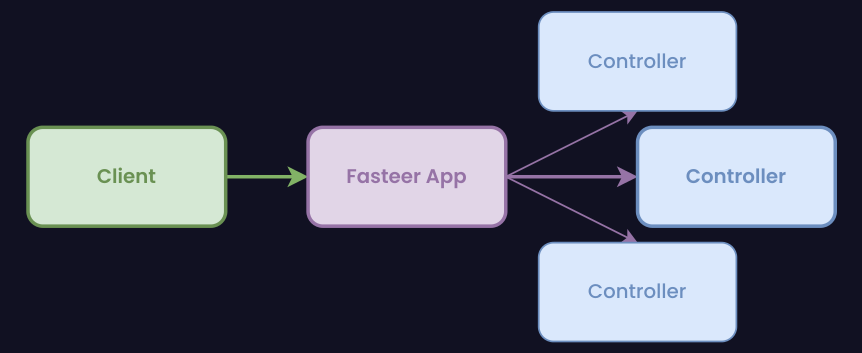

# Using Controllers

[[toc]]

A controller's purpose is to receive specific requests for your REST application. Frequently, each controller handles more than one route, and different routes can perform different actions.

## Creating Controllers in Fasteer

### Defining controllers

Let's start by creating a new controller file, `HelloController.ts` (or `HelloController.js` if you are not using TypeScript)

If you are not using ES6 modules, use the exported `ctrl` function and wrap your controller inside of it, this function provides backwards-compatibility with RequireJS and also gives yout TypeScript definitions.

<code-group>
<code-block title="TS" active>
<<< src/code-snippets/the-basics/controllers/defining-controllers/01/snippet-ts.ts
</code-block>

<code-block title="JS (ES6)">
<<< src/code-snippets/the-basics/controllers/defining-controllers/01/snippet-es6.js
</code-block>

<code-block title="JS">
<<< src/code-snippets/the-basics/controllers/defining-controllers/01/snippet-js.js
</code-block>
</code-group>

### Route Prefix

You can set a route prefix (for example `/user` in UserController) for each of the controller's route. To do so, export a string variable `routePrefix` with the prefix.

If you are not using ES6 modules, pass the route prefix as the second parameter of the
`ctrl` function.

<code-group>
<code-block title="TS" active>
<<< src/code-snippets/the-basics/controllers/route-prefix/01/snippet-ts.ts
</code-block>

<code-block title="JS (ES6)">
<<< src/code-snippets/the-basics/controllers/route-prefix/01/snippet-es6.js
</code-block>

<code-block title="JS">
<<< src/code-snippets/the-basics/controllers/route-prefix/01/snippet-js.js
</code-block>
</code-group>

### Registering controllers

All controllers are registered via the `controllers` property in options passed to the `hookFastify` function, like so:

<<< src/code-snippets/the-basics/controllers/registering-controllers/01/snippet.js

You can use glob syntax while defining paths for controllers, as Fasteer uses [node-glob](https://npmjs.com/package/glob) under the hood.

You can also pass it the controller function directly, for example:

<<< src/code-snippets/the-basics/controllers/registering-controllers/02/snippet.js

This can be especially useful if you want to make an abstraction on top of Fasteer.

## Standalone usage of Fasteer's Controllers

You can leverage the functionality of Fasteer's controllers without FasteerInstance using the exported `useControllers` function, like so:

<code-group>
<code-block title="TS / JS (ES6)" active>
<<< src/code-snippets/the-basics/controllers/standalone-usage/01/snippet-es6.js
</code-block>

<code-block title="JS">
<<< src/code-snippets/the-basics/controllers/standalone-usage/01/snippet-js.js
</code-block>
</code-group>

To see all options you can pass, see the [API Reference](#whereami). // TODO