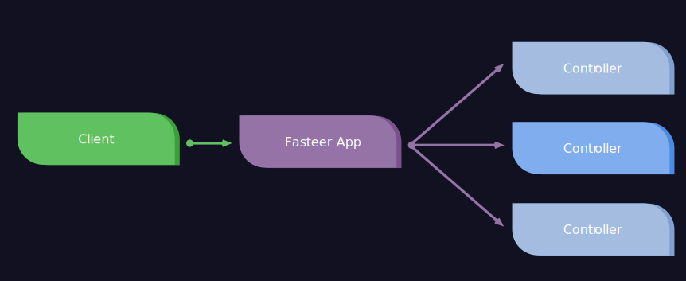

# Using Controllers

[[toc]]

A controller's purpose is to receive specific requests for your REST application. Frequently, each controller handles more than one route, and different routes can perform different actions.



## Creating Controllers in Fasteer

### Defining controllers

Let's start by creating a new controller file, `HelloController.ts` (or `HelloController.js` if you are not using TypeScript)

If you are not using ES6 modules, use the exported `ctrl` function and wrap your controller inside of it, this function provides backwards-compatibility with RequireJS and also gives yout TypeScript definitions.

<code-group>
<code-block title="TS" active>
```ts
import { Fasteer } from "@fasteerjs/fasteer"

// Fasteer.FCtrl is a shortcut for Fasteer.FunctionalController
const HelloController: Fasteer.FCtrl = fastify => {
  fastify.get("/", (req, res) => res.send("Hello World"))
}

export default HelloController
```
</code-block>
<code-block title="JS (ES6)">
```ts
const HelloController = fastify => {
  fastify.get("/", (req, res) => res.send("Hello World"))
}

export default HelloController
```
</code-block>
<code-block title="JS">
```ts
const { ctrl } = require("@fasteerjs/fasteer")

// Not using arrow functions to give the controller a name,
// otherwise Fasteer would name it "(anonymous controller)"
module.exports = ctrl(function HelloController(fastify) {
  fastify.get("/", (req, res) => res.send("Hello World"))
})
```
</code-block>
</code-group>

### Route Prefix

You can set a route prefix (for example `/user` in UserController) for each of the controller's route. To do so, export a string variable `routePrefix` with the prefix.

If you are not using ES6 modules, pass the route prefix as the second parameter of the
`ctrl` function.


<code-group>

<code-block title="TS" active>
```ts
import { Fasteer } from "@fasteerjs/fasteer"

const HelloController: Fasteer.FCtrl = fastify => {
    // ...
}

// Prefixes all routes with /hello
export const routePrefix = "/hello" 

export default HelloController
```
</code-block>

<code-block title="JS (ES6)">
```ts
const HelloController = fastify => {
    // ...
}

// Prefixes all routes with /hello
export const routePrefix = "/hello" 

export default HelloController
```
</code-block>

<code-block title="JS">
```ts
const { ctrl } = require("@fasteerjs/fasteer")

module.exports = ctrl(function HelloController(fastify) {
  fastify.get("/", (req, res) => res.send("Hello World"))
}, "/hello") // Prefixes all routes with /hello
```
</code-block>

</code-group>


### Registering controllers

All controllers are registered via the `controllers` property in options passed to the `hookFastify` function, like so:

```ts
// ... imports

const fasteer = hookFastify({
  controllers: [
    './HelloController.ts', // to register HelloController.ts
    './controllers/*.ts' // to register all .ts files in the controllers folder
  ]
});
```

You can use glob syntax while defining paths for controllers, as Fasteer uses [node-glob](https://npmjs.com/package/glob) under the hood.

You can also pass it the controller function directly, for example:

```ts
// ... imports

const fasteer = hookFastify({
  controllers: [
    async (fastify) => {
      // ... controller logic here
    }
  ]
})
```

This can be especially useful if you want to make an abstraction on top of Fasteer.

## Standalone usage of Fasteer's Controllers

You can leverage the functionality of Fasteer's controllers without FasteerInstance using the exported `useControllers` function, like so:

<code-group>
<code-block title="TS / JS (ES6)" active>
```ts
import { useControllers } from "@fasteerjs/fasteer"
import fastify from "fastify"

const app = fastify()

useControllers({
  controllers: [
      // ... register controllers the same way you would in hookFastify
  ],
}, app)
```
</code-block>

<code-block title="JS">
```ts
const { useControllers } = require("@fasteerjs/fasteer")
const fastify = require("fastify")

const app = fastify()

useControllers({
  controllers: [
      // ... register controllers the same way you would in hookFastify
  ],
}, app)
```
</code-block>
</code-group>

To see all options you can pass, see the [API Reference](#whereami). // TODO